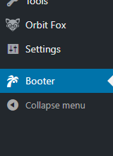
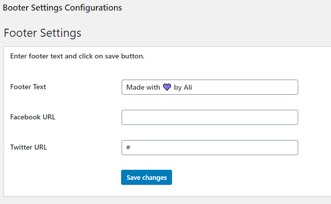

# Brief 13

Ce plugin ajoute un footer en bas des pages.

## Installation

1. Copiez le dossier Booter puis le placez dans le chemain suivant : "VotreSiteWeb"/wp-content/plugins
2. Ouvrez la page admin dans votre navigateur, puis clickez sur "Plugins" -> "Installed plugins"
3. Activez le plugins sous le nom Booter
4. Une nouvelle option sous le nom Booter a été ajoutée, clickez le
5. Remplir les champs puis clickez sur le button "Save changes".

## Captures d'écran

  

  

  

